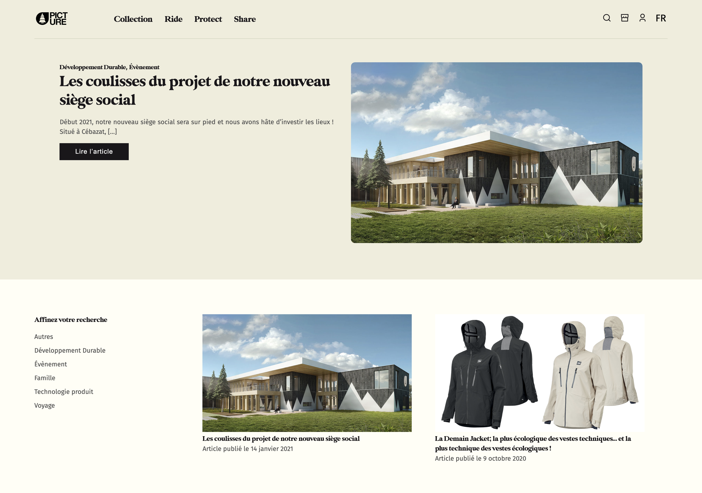

# Picture blog Wordpress

Création d'un thème Wordpress sur-mesure effectué lors de mon stage au sein de l'agence digitale **Ultrō** pour le compte de **Picture Organic Clothing**.

## 👀 Objectifs

- Afficher tous les articles sur la page d'accueil (`index.php`)
- Trier les articles par catégories (`archive.php`)
- Mettre en place un système de pagination + Afficher un template spécial si page > 1 (`pagination.php`)
- Traduire le contenu et formatter dates en Anglais + Ajouter un switcher de langues dans le menu du header
- Ajout d'un slider dynamique en Javascript (cf. "Slick Slider") pour afficher une liste d'articles appartenant à une certaine catégorie (`single.php`)
- Gestion du responsive tablette et mobile

## 🚀 Installation

- git clone 
- cd picture-wordpress-theme
- docker-compose -f stack.yml up
- http://localhost:8080

Fichier pour importer articles, catégories, images.. disponible sous:  
`picture` > `assets` > `src` > `wordpress` > `pictureblog.wp.xml`

## 💫 Live

[http://poc-wp.atwebpages.com](http://poc-wp.atwebpages.com/)
